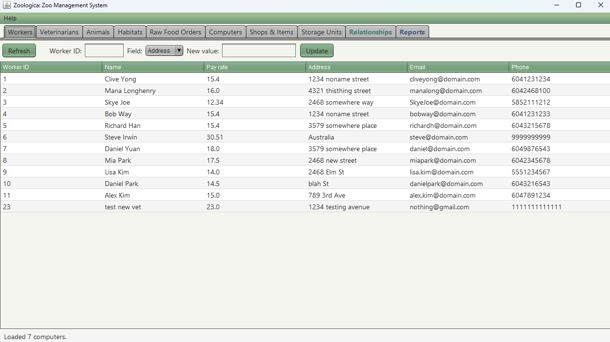
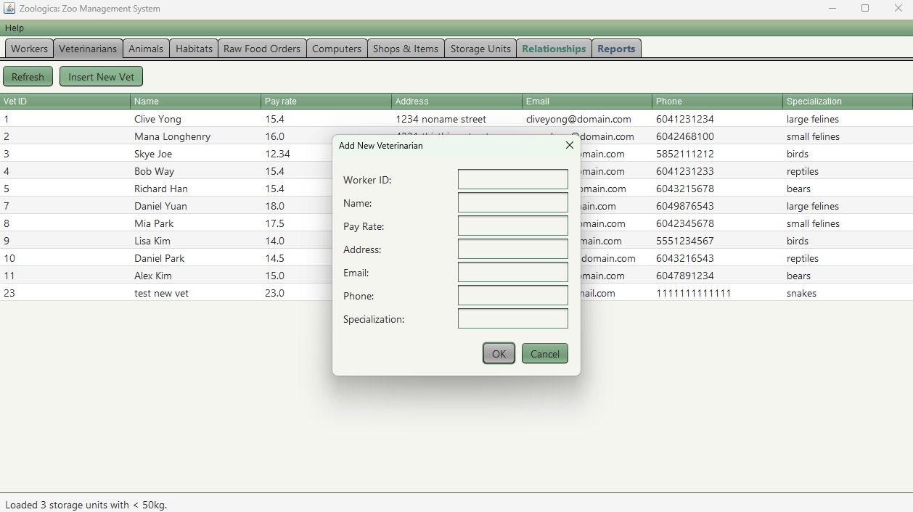

# Zoologica: Zoo Management System (Java + Swing + PostgreSQL)

A desktop application for managing a zoo’s operations, built with **PostgreSQL** and **Java**.

This started as a university database course project using Oracle. I have refactored and modernized it into its current form.

* Refactored a legacy 6,000+ line Java codebase into ~1,900 lines (≈69% reduction) by extracting shared helpers for table creation and tab construction,replacing generic object arrays with typed model classes and explicit mapping.
* Migrated the old course-style Oracle schema and data to a modern **PostgreSQL** stack by rewriting SQL queries to use PostgreSQL features, centralizing configuration in one connection handler, and removing Oracle-specific helpers, ensuring that all database access goes through a single PostgreSQL-backed API.
* Implemented transaction safe operations and fixed data persistence issues by wrapping multi-step writes into blocks and adding connection rollbacks to consistently commit or rollback, ensuring updates persist across application resets.
* Redesigned Swing UI into a structured multi-tab interface instead of a monolithic window by splitting JWindow into focused methods and creating self-contained panels.
* Added higher quality UX features by implementing modal dialogs for workflows with forms, validation and transactional inserts, adding search flow and filter labelling.
* Added quality-of-life features (dialogs, search, theming, better sorting)

## Tech Stack

* **Language:** Java 17+
* **Database:** PostgreSQL
* **GUI:** Swing (w/ Nimbus)

## Screenshots




## Features

### Core tabs

Each major entity has its own tab with a JTable view and basic controls. Tables share a consistent visual style and support sorting.

* **Animals**

  * View animals with IDs, names, species/genus, and assigned habitat.
  * Backed by `animals1` and `animals2`.

* **Habitats**

  * View habitat ID, name, biome, area, temperature, and humidity.
  * Backed by `habitats1` and `habitats2`.

* **Workers**

  * View workers, including name, pay rate, address, email, and phone.
  * Update worker fields via the UI (with basic validation, e.g., phone length).
  * Backed by `workers`.

* **Veterinarians**

  * View veterinarians and their associated worker data.
  * **Add Veterinarian dialog:**

    * Opens a modal form for ID, name, pay rate, contact info, and specialization.
    * On save:

      * Inserts into `workers`
      * Inserts into `veterinarians`

* **Shops & Items**

  * Shops: shop ID and type from `shops`.
  * Items: inventory associated with shops from `items`.
  * Foreign keys from `items` → `shops`.

* **Storage & Raw Food Orders**

  * Storage units with capacity, temperature, and type (`storage_units`).
  * Raw food orders (weights, vendors, dates) from `raw_food_orders`.

* **Computers**

  * View computers assigned to workers:

    * Computer ID, Worker ID, model, manufacturer, type.
    * Combined via join of `computers1` and `computers2`.

  * **Search by Manufacturer:**

    * Prompt dialog for manufacturer.
    * Executes a case-insensitive search (`ILIKE '%term%'`) on `computers2.manufacturer`.
    * Updates the main table to show only matching computers.
    * Label to show the current filter, e.g.
      `Filter: manufacturer contains "Dell"`.
    * Refresh button clears the filter and reloads all computers.

### Relationships tab

The **Relationships** tab exposes the many-to-many and associative tables that tie the core entities together, such as:

* `cohabitates_with` – which animals share enclosures.
* `maintains_health_of` – which veterinarians maintain which animals.
* `feeds` – which zookeepers feed which animals.
* `made_from` – mapping between raw food orders and prepped food.
* `assigned_to`, `works_at`, `stored_at`, `located_at` – how workers, places, and items are connected.

This tab helps visualize the relational design beyond simple single-table views.

### Reports tab

The **Reports** tab is reserved for more complex SQL over the same schema. Examples include:

* Workers or veterinarians below/above certain pay thresholds.
* Aggregates over storage usage or food orders.
* “Super zookeepers” (e.g., those feeding many animals) and other role-based summaries.

This tab showcases SQL beyond simple `SELECT *` queries, using joins and aggregates for more interesting views over the data.

## Database Schema

The schema models a small but realistic zoo environment.

**Core entity tables** include:

* `animals1`, `animals2`
* `habitats1`, `habitats2`
* `workers`, `zookeepers`, `veterinarians`
* `shops`, `items`
* `storage_units`
* `raw_food_orders`, `prepped_food`
* `computers1`, `computers2`
* `vendors`

**Relationship/association tables** include:

* `feeds` – zookeeper ↔ animal
* `cohabitates_with` – animal ↔ animal
* `maintains_health_of` – vet ↔ animal
* `made_from` – raw food ↔ prepped food
* `assigned_to`, `works_at` – worker ↔ place
* `stored_at`, `located_at` – items and storage units ↔ places

All tables and sample data are created by `sql/init.sql`.

## Setup & Running

### 1. Set up PostgreSQL

1. Install and start PostgreSQL.

2. Create a user and database (example):

   ```sql
   -- As postgres superuser:
   CREATE USER zoo WITH PASSWORD 'zoo';
   CREATE DATABASE zoo OWNER zoo;
   ```

3. Load the schema and sample data:

   ```bash
   psql -h localhost -p 5432 -U zoo -d zoo -f sql/init.sql
   ```

   Adjust host, port, user, and db name if your environment is different.

### 2. Configure the application

In `DatabaseConnectionHandler.java`, set the connection details to match your PostgreSQL setup:

```java
private static final String DB_URL      = "jdbc:postgresql://localhost:5432/zoo";
private static final String DB_USER     = "zoo";
private static final String DB_PASSWORD = "zoo";
```

Make sure the PostgreSQL JDBC driver is on your classpath, e.g.:

* Maven/Gradle dependency: `org.postgresql:postgresql`
* Or a local JAR in a `lib/` directory.

### 3. Run the application

**From an IDE (IntelliJ, Eclipse, etc.)**

1. Import as a Java project.
2. Ensure the PostgreSQL driver jar is configured as a library/dependency.
3. Run the `main` method in `UI.ZooController`.
